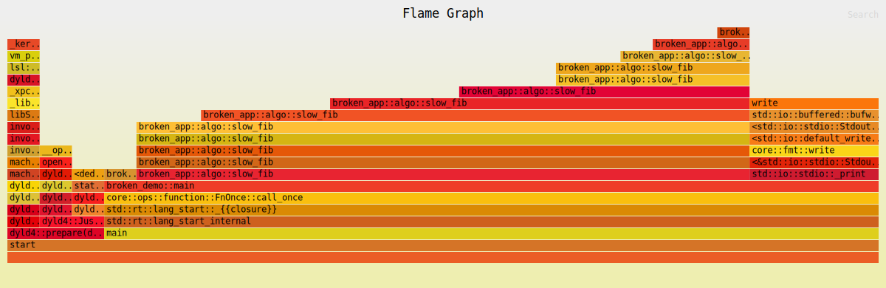
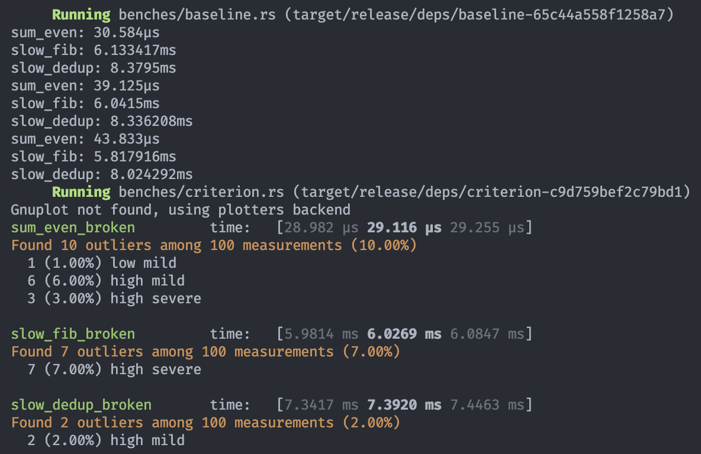
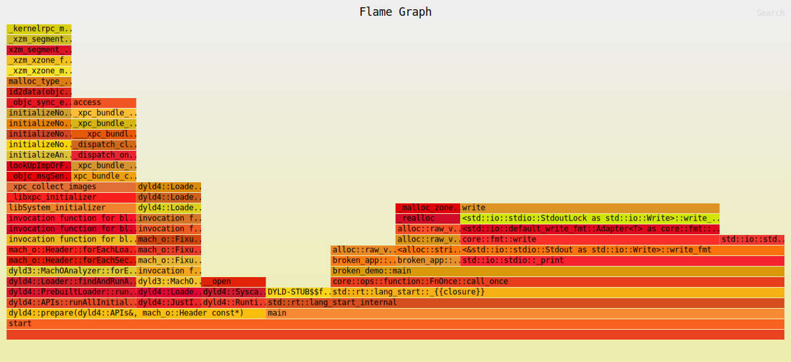
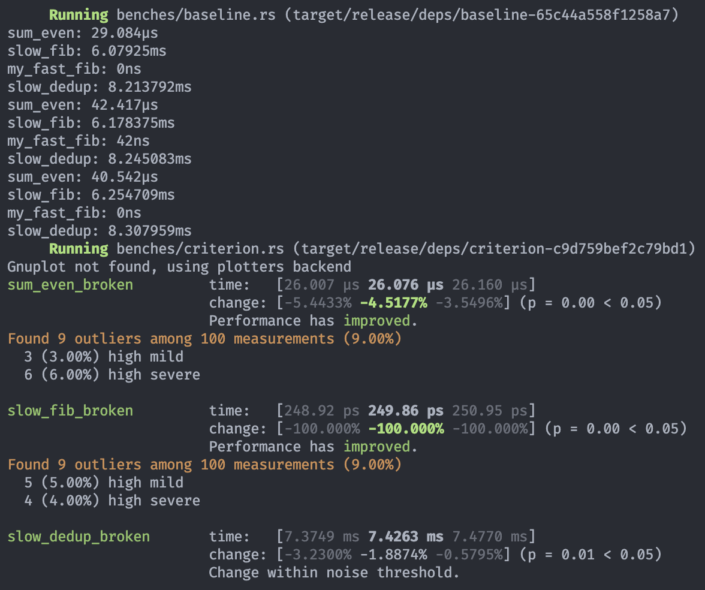
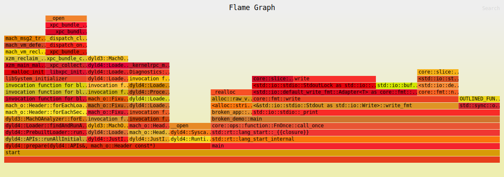
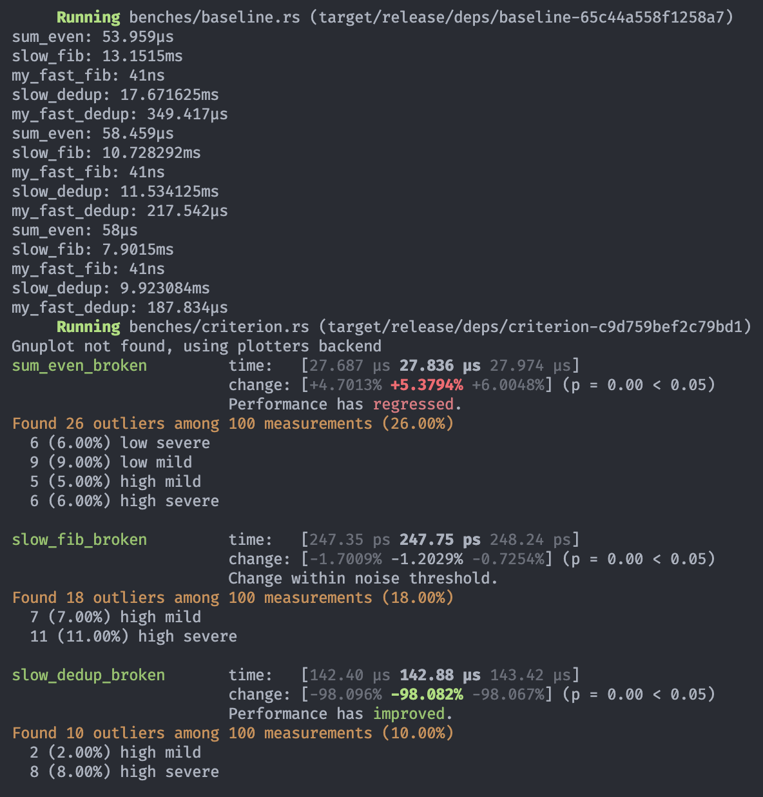
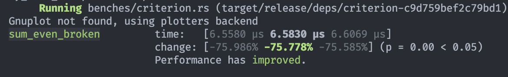

# Проектная работа rust 5

Егоров Дмитрий

Все санитайзеры и линтеры запускаются на github actions, т.к. с локальным запуском на macbook m возникают трудности

## Настройка pre-commit

Включение pre-commit `pre-commit install`

Локальный запуск `pre-commit run --verbose --all-files`

## Broken App

```bash
# Запуск demo
cargo run -p broken-app --bin broken-demo

# Запуск test
cargo test -p broken-app
```

## Docker

Для локальный запусков

```bash
# Запуск colima
colima start --vm-type=vz --vz-rosetta --cpu 4 --memory 8 --disk 60

# Сборка docker image
docker buildx build -t rust-dev --no-cache --load .

# Запуск docker image
docker run -it --rm --privileged -v $(pwd):/app -w /app rust-dev bash

# Запуск miri
cargo +nightly miri test -p broken-app --test integration

# Запуск valgrind
VALGRIND_OPTS="--leak-check=full --show-leak-kinds=definite" cargo valgrind test -p broken-app --test integration

# ASan
RUSTFLAGS="-Zsanitizer=address" cargo +nightly test -p broken-app --test integration -Zbuild-std --target aarch64-unknown-linux-gnu

# TSan
RUSTFLAGS="-Zsanitizer=thread" cargo +nightly test -p broken-app --test integration -Zbuild-std --target aarch64-unknown-linux-gnu
```

## История оптимизаций

### Первый запуск

Оптимизация измерялась следующими инструментами:

- Запуск `CARGO_PROFILE_RELEASE_DEBUG=true cargo flamegraph -p broken-app --bin broken-demo` с циклом 0..1000
- Запуск `cargo bench -p broken-app`





### Итерация 1

Проблема в fib функции, поэтому написал новую функцию my_fast_fib. Повторный запуск bench и flamegraph





### Итерация 2

Наблюдаю, что во flamegraph в лидеры вышла функция slow_dedup и normalize. Оптимизирую slow_dedup





### Итерация 3

Оптимизация функции из бенчмака sum_even. Переписана на my_fast_sum_even


